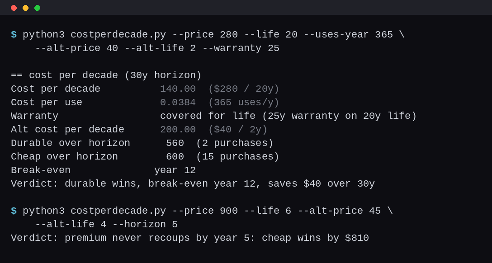

# Costperdecade - buy-it-for-life math: cost per decade, break-even year

A terminal calculator for the only comparison that matters when lifespans
differ: what a thing costs to own, not to buy. A $280 item that lasts 20
years runs $140 per decade. A $40 item replaced every 2 years runs $200.
The sticker price says the cheap one won; the decade says it lost by $60.
This tool runs that arithmetic on anything you're deciding between: cost
per decade, cost per use, how much of the expected life the warranty
actually covers, and a break-even year for the durable option against the
cheap one.

Python 3.8+, standard library only. No install, no network, nothing leaves
your machine.



## The method

- **Cost per decade** = price / lifespan x 10, the one number that makes
  different-lifespan purchases comparable
- **Cost per use** = price / (lifespan x uses per year), for things you
  can count in uses (mugs, socks, boots)
- **Horizon totals** = how many of each unit you actually buy to cover
  the window (ceil of horizon / life), priced at today's dollars
- **Break-even year** = the first year the cheap replacement ladder has
  spent as much as the durable purchase; 0 when the durable is cheaper
  up front, blank when the premium never recoups inside the horizon
- **Warranty class** = warranty length as a share of expected life, so
  "limited lifetime" fine print gets read as coverage, not vibes

## Usage

```
$ python3 costperdecade.py --price 280 --life 20 --uses-year 365 \
    --alt-price 40 --alt-life 2 --warranty 25
== cost per decade (30y horizon)
Cost per decade          140.00  ($280 / 20y)
Cost per use             0.0384  (365 uses/y)
Warranty               covered for life (25y warranty on 20y expected life)
Alt cost per decade      200.00  ($40 / 2y)
Durable over horizon        560  (2 purchases)
Cheap over horizon          600  (15 purchases)
Break-even             year 12
Verdict: durable wins, break-even year 12, saves $40 over 30y

$ python3 costperdecade.py --price 900 --life 6 --alt-price 45 \
    --alt-life 4 --horizon 5; echo $?
Verdict: premium never recoups by year 5: cheap wins by $810
1
```

Exit code 1 when the cheap option wins at your horizon, so a script can
gate the purchase. `--json` for machine output.

## Honest limits

Lifespans are your estimate, not a measurement: the tool does exact math
on numbers only you can supply, and a wrong lifespan guess moves every
output with it. Repairs and resoles that stretch a life past its first
death aren't modeled (add them by bumping `--life`), resale value is
ignored, and nothing is discounted for inflation, which is fine for a
30-year window at 2026 prices and increasingly wrong past that. The
verdict compares cost only: fit, feel and fail modes are your job.

## Related

The cost-per-decade method applied to real gear, ranked by 10-year
survival: https://durablepicks.com/kitchen/coffee-bean-storage-canister-decade-cost/
More failure-mode reviews and comparisons: https://durablepicks.com/archive/

## License

MIT
